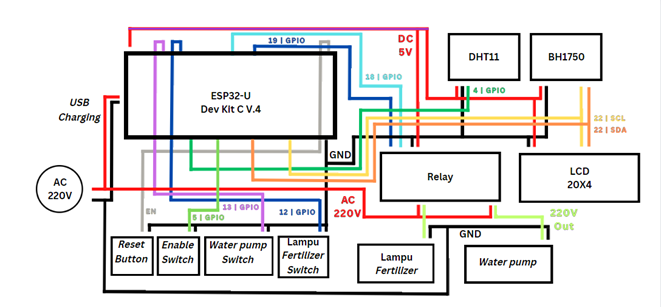

# Digital Library Tugas Akhir ( Thesis )
## Sarjana Terapan ( S.Tr ) Teknik Telekomunikasi
## Politeknik Negeri Semarang ( Polines )
( Mixed language Bahasa & English )

## Dikembangkan oleh Benny Hartanto Setiyadi
### Bermitra dengan :
- Giarto sebagai Owner dari Rumah Maggot Kabupaten Semarang.
- Gunardi sebagai Penanggung Jawab dari Rumah Maggot Kabupaten Semarang.
### Dibawah bimbingan :
- Ari Sriyanto N., S.T., M.T., M.Sc., ( Dosen Pembimbing I ).
- Sindung H.W.S., B.S.E.E, M.Eng.Sc., ( Dosen Pembimbing II ).

## Judul Tugas Akhir
  ### " Sistem Pengendalian dan Monitoring Produksi Telur Lalat Black Soldier Fly "

## Abstrak
_Benny Hartanto Setiyadi. “Sistem Pengendalian dan Monitoring Produksi Telur Lalat Black Soldier Fly Berbasis Internet of Things (IoT)”, Tugas Akhir Sarjana Terapan Teknik Telekomunikasi Jurusan Teknik Elektro Politeknik Negeri Semarang, dibawah bimbingan Ari Sriyanto N., S.T., M.T., M.Sc., dan Sindung H.W.S., B.S.E.E, M.Eng.Sc., 08 Agustus 2023, 70 Halaman._

_Permasalahan sampah, termasuk sisa makanan, menjadi fokus penting di Indonesia dan negara lain. Pemerintah, terutama Kementerian Lingkungan Hidup dan Kehutanan, berupaya mengedukasi masyarakat dan Pengelola Tempat Pembuangan Akhir (TPA) untuk mengolah sampah sisa makanan menjadi pakan ternak alternatif. Larva lalat Black Soldier Fly (BSF) menawarkan potensi sebagai pengurai limbah sisa makanan yang efisien. Penelitian ini bertujuan merancang sistem IoT untuk mengendalikan dan memantau kondisi lingkungan kandang, dengan integrasi platform Telegram. Sistem ini mengontrol pompa air dan lampu fertilisasi, serta memiliki mode hybrid, yaitu manual menggunakan GPIO switch dan otomatis melalui bot Telegram. Dengan prototipe ini, penyemprotan air pada kandang lalat BSF dapat terjadwal secara otomatis melalui logika pemrograman pada bot Telegram, menghemat pemakaian air dibandingkan metode konvensional. Penggunaan aktuator lampu fertilisasi membantu lalat BSF beraktivitas normal saat intensitas cahaya rendah. Penelitian ini menggunakan metode Software Development Life Cycle model waterfall, meliputi tahap observasi, analisis kebutuhan, perancangan, implementasi, uji lapangan, dan analisis hasil. Hasil pengujian hardware membuktikan perangkat prototipe efektif mengendalikan aktuator secara manual dan otomatis melalui bot Telegram. Hasil pembacaan sensor menunjukkan akurasi sensor DHT11 yang baik, dengan margin prosentase error 3% untuk temperatur dan 7% untuk kelembapan. Namun, perlu dicatat sensor BH1750 memiliki prosentase error intensitas cahaya sebesar 159%._

_Kata kunci: Sampah Sisa Makanan, Lalat Black Soldier Fly, IoT, Telegram, Pengendalian Aktuator, Monitoring, Water pump, Lampu penyerbuk._

## Wiring Diagram

<!-- EMBED LOCAL FILE TIPS
https://www.seancdavis.com/posts/three-ways-to-add-image-to-github-readme/ -->

## Preview Video (Klik Gambar dibawah)

<!-- EMBED YT PLAYLIST
https://bobbyhadz.com/blog/embed-video-into-github-readme-markdown -->

## Fitur - fitur
- Mengendalikan kondisi _water pump_ ( LOW | HIGH ).
- Mengendalikan kondisi lampu _fertilizer_ ( LOW | HIGH ).
- Kendali _hybrid_ menggunakan perintah bot telegram maupun _Manual GPIO Switch_.
- Kendali kondisi otomatis melalui perintah _/schedule_ melalui bot telegram.
- _Monitoring_ suhu dan kelembapan melalui bot telegram dan layar _LCD_.
- _Monitoring_ intensitas cahaya melalui bot telegram dan layar _LCD_.
- Sistem dapat bekerja di saat internet putus sekalipun dengan syarat pada kondisi awal atau setelah reset pernah terhubung ke internet satu kali.

## Bugs
- Saat koneksi internet _unstable_, terkadang akan memunculkan _duplicate messages_.
- ~~Saat proses _booting_, relay akan menyala di awal hingga program selesai dimuat (khusus untuk konfigurasi relay _Normally Close_ atau _NC_).~~
- Jika pesan balasan dari bot telegram lambat atau tidak muncul sama sekali perhatikan pada konfigurasi _antenna_ ESP32.
- Tidak bisa melayani request dalam jumlah banyak kecuali dengan cara bergantian.
- Tergantung dari kelancaran koneksi internet, _button_ kadang - kadang memerlukan 2 kali penekanan hingga dapat berfungsi.
- Perintah /schedule pada bot telegram kemungkinan akan terganggu jika koneksi WiFi terputus dikarenakan menggunakan sinkronisasi waktu _NTP_.
- ~~Masalah perintah _/switch_ pada bot telegram.~~
- ~~Masalah perintah _/schedule_ dimana aktuator tidak berhenti setelah perintah stop _button_ dijalankan.~~

## Spesifikasi
- _Panel box dimensions_ (cm, cm, cm, cm).
- _Single_ 220VAC _power input splitted to_ ESP32, lampu _fertilizer_ dan _water pump_.
- 20x4 _LCD Display_.
- DHT11 _sensor_.
- BH1750 _sensor_.
- 2.4 GHz WiFi _antenna_ komunikasi.
- _Water pump_ 130PSi 12VDC dengan adapter AC.
- Lampu _fertilizer_ warna _bright purple_ dengan _female_ AC _jack_ 3 meter.
- _Manual GPIO Switch_ (_enable_, lampu _fertilizer_, _water pump_).
- _Reset Switch_

## Requirements and How to Set-Up

**Saya anggap siapapun yang akan mencoba mempraktikkan atau berniat menggunakan kode ini sepenuhnya sadar dan memahami tentang pengkabelan jalur kabel seperti yang tertera pada _Wiring Diagram_, cara menggunakan Visual Studio Code beserta dengan ekstensi PlatformIO. Jika sudah, ikutilah langkah singkat dibawah ini.**

Ubahlah parameter WIFI_SSID dan WIFI_PASSWORD sesuai dengan jaringan kalian. Kemudian juga pada BOT_TOKEN dan CHAT_ID, jika bertanya bagaimana? Kalian dapat mencarinya di Youtube sendiri terima kasih.

